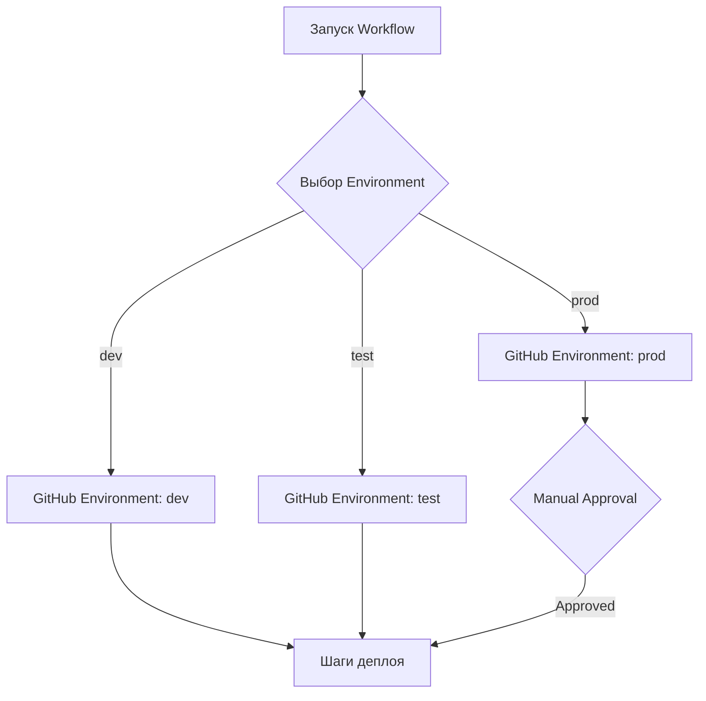

# Стратегия деплоя через GitHub Actions

Этот документ описывает архитектуру GitHub Actions workflow для ручного деплоя приложения на различные окружения.

## 1. Входные параметры (Workflow Dispatch)

Для запуска деплоя используется событие `workflow_dispatch`. Пользователь может настроить следующие параметры:

- **Ветка (Branch)**: Выбирается стандартным интерфейсом GitHub перед запуском.
- **Целевой сервер (Environment)**: Выпадающий список со значениями:
  - `dev` (Development)
  - `test` (Testing/Staging)
  - `prod` (Production)

## 2. Использование GitHub Environments

Для управления деплоем используются [GitHub Environments](https://docs.github.com/en/actions/deployment/targeting-different-environments/using-environments-for-deployment).

### Преимущества:
- **Секреты**: Каждое окружение (`dev`, `test`, `prod`) имеет свой набор секретов (например, `SERVER_IP`, `SSH_KEY`).
- **Аппрувы**: Для окружения `prod` можно настроить обязательное подтверждение (Required Reviewers).
- **История**: GitHub отслеживает историю деплоев для каждого окружения.

### Схема переключения:
Workflow динамически подставляет выбранное пользователем значение в поле `environment` джобы.



## 3. Структура YAML файла

Ниже представлена архитектура файла `.github/workflows/deploy.yml`.

```yaml
name: Manual Deployment

on:
  workflow_dispatch:
    inputs:
      environment:
        description: 'Выберите целевой сервер для деплоя'
        required: true
        default: 'dev'
        type: choice
        options:
          - dev
          - test
          - prod

jobs:
  deploy:
    name: Deploy to ${{ github.event.inputs.environment }}
    runs-on: ubuntu-latest
    
    # Привязка к GitHub Environment для доступа к секретам и аппрувам
    environment: ${{ github.event.inputs.environment }}

    steps:
      - name: Checkout code
        uses: actions/checkout@v4

      - name: Setup Environment Variables
        run: |
          echo "Deploying to ${{ github.event.inputs.environment }} server"
          # Здесь можно добавить логику подготовки переменных

      - name: Build Application
        run: |
          echo "Running build process..."
          # Пример: npm install && npm run build

      - name: Deploy to Server
        run: |
          echo "Executing deploy to ${{ vars.SERVER_HOST }}"
          # Здесь используется секрет или переменная, специфичная для Environment
          # Пример: ssh user@${{ vars.SERVER_HOST }} 'bash -s' < deploy_script.sh
```

## 4. Рекомендации по настройке

1. **Создание окружений**: Перейдите в `Settings -> Environments` в репозитории и создайте три окружения: `dev`, `test`, `prod`.
2. **Секреты и переменные**:
   - Добавьте `SERVER_HOST` как переменную (Variable) внутри каждого окружения.
   - Добавьте `SSH_PRIVATE_KEY` как секрет (Secret) внутри каждого окружения.
3. **Защита Prod**: В настройках окружения `prod` включите "Required reviewers", чтобы предотвратить случайный деплой без проверки.
